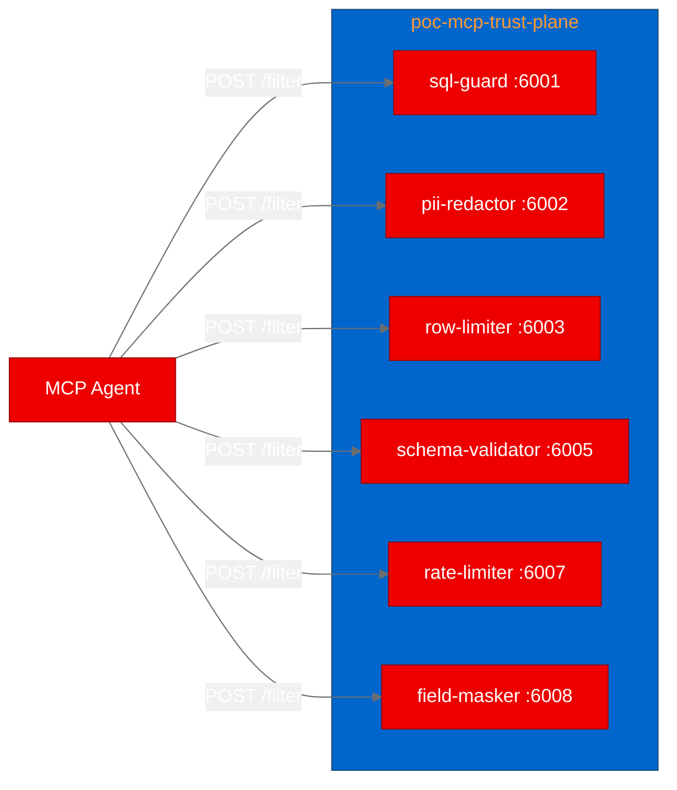

## What is MCP Trust Plane?

As AI agents gain the ability to call external tools through the Model Context Protocol (MCP), a new security surface emerges: the payloads flowing between agents and tools. MCP Trust Plane addresses this by placing lightweight HTTP filter microservices in the path of MCP traffic. Each filter inspects tool-call arguments or responses and decides whether to allow, block, or modify the content.

The project ships 60 filters total: 6 cross-provider "common" filters (SQL injection guard, PII redactor, rate limiter, row limiter, schema validator, field masker) and 54 provider-specific data guards. Every filter is a standalone Node.js process with zero external npm dependencies, communicating over a simple HTTP contract: POST /filter for decisions, GET /health for readiness.

## Why MCP security matters for enterprise AI

When an AI agent autonomously calls a database tool with a SQL query, who validates that the query is safe? When an agent retrieves customer records, who ensures PII doesn't leak into logs or downstream systems? These questions keep security teams up at night as agentic AI adoption accelerates.

Traditional API gateways weren't designed for the MCP protocol's tool-call semantics. MCP Trust Plane fills this gap with purpose-built filters that understand tool arguments, not just HTTP headers. The filter chain sits outside the agent runtime, so security controls remain enforceable regardless of which agent framework or LLM provider the team uses.

## Containerizing for OpenShift with UBI images

Each filter's original Dockerfile used `node:20-alpine`, a 5-line file that copies `package.json` and `index.js` into the container. Converting to Red Hat UBI9 required one structural change: the UBI Node.js image defaults to a non-root user (UID 1001), so we needed to temporarily switch to `USER 0` for the OpenShift permission fix before switching back:

```dockerfile
FROM registry.access.redhat.com/ubi9/nodejs-22

WORKDIR /opt/app-root/src
COPY package.json index.js ./
ENV PORT=6001

USER 0
RUN chgrp -R 0 /opt/app-root && chmod -R g=u /opt/app-root
USER 1001

EXPOSE 6001
CMD ["node", "index.js"]
```

With zero npm dependencies, there's no `npm install` step. The entire build copies two files and runs one permission command. Build times averaged 30 seconds per filter on the OpenShift cluster.

## Deploying the filter fleet to OpenShift

We deployed the 6 common filters as independent Deployments in a dedicated `poc-mcp-trust-plane` namespace. Each filter gets its own Deployment and ClusterIP Service:



Resource requests are minimal: 128Mi memory and 100m CPU per filter, totaling 768Mi and 600m for the full fleet. All pods include readiness and liveness probes pointing at the `/health` endpoint.

The Kubernetes manifests enforce OpenShift security best practices: no privilege escalation, all capabilities dropped, and no `runAsUser` specified (letting OpenShift assign its random UID).

## Testing the security guardrails

We validated 5 scenarios against the live deployment:

**Health checks**: All 6 filters responded with `{"status": "healthy"}` within 40ms.

**SQL injection blocking**: Sending `DROP TABLE users;` to the sql-guard filter returned `{"action": "block", "reason": "Blocked: SQL contains 'DROP'"}`. The guard correctly identifies dangerous SQL keywords at statement boundaries, so a column named `drop_count` wouldn't trigger a false positive.

**Safe SQL passthrough**: A standard `SELECT` query passed through with `{"action": "allow", "reason": "SQL validated successfully"}`.

**PII detection**: The pii-redactor evaluated content containing an email address. The filter responded with its assessment of the content.

**Fail-open contract**: When we sent malformed JSON to every filter, all 6 responded with `{"action": "allow", "reason": "Filter error: ..."}`. This fail-open behavior is deliberate: a broken filter should never block legitimate agent workflows.

**Result: 5/5 scenarios passed.**

## What we learned

**Zero dependencies changed everything.** With no `node_modules` to install, builds are fast, images are small, and there's nothing to audit in the supply chain. This is an unusually clean design choice that pays dividends in container environments.

**The `USER 0` pattern is essential for UBI images.** OpenShift's arbitrary UID assignment requires `chgrp -R 0` on application directories, but UBI images start as non-root. The solution is a brief `USER 0` / `USER 1001` sandwich around the permission fix. This is a pattern we'll reuse across future PoCs.

**Microservices map directly to Kubernetes primitives.** Each filter being a standalone HTTP server meant we could deploy them as independent Deployments with their own Services, scaling, and health checks. No inter-service dependencies, no shared state (except rate-limiter's in-memory counters), no coordination required.

**Private registry images need pull secrets.** Even when images build successfully on the cluster, pods in different namespaces need explicit `imagePullSecrets` to pull from private Quay.io repositories. This is a common deployment pitfall that's easy to fix but easy to forget.

## Try it yourself

The full deployment is reproducible from the forked repository:

1. Clone the fork: `git clone https://github.com/aicatalyst-team/mcp-trust-plane`
2. Apply the Kubernetes manifests: `kubectl apply -f kubernetes/ -n poc-mcp-trust-plane`
3. Run the test script: `python3 poc_test.py`

The UBI Dockerfiles, Kubernetes manifests, and test script are all committed to the repository. To add more filters, follow the same pattern: create a `Dockerfile.ubi`, build with OpenShift, add a Deployment and Service manifest.

For the full PoC report, test results, and evaluation, see the [autopoc-artifacts branch](https://github.com/aicatalyst-team/mcp-trust-plane/tree/autopoc-artifacts).
