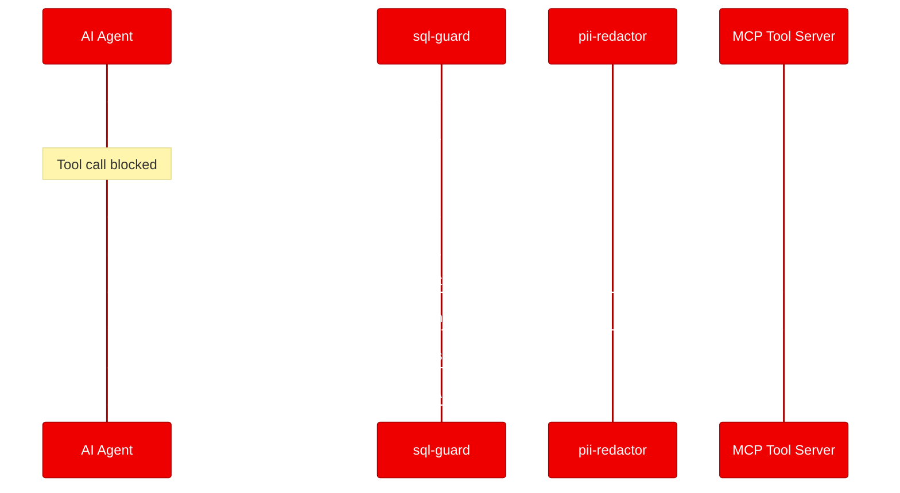
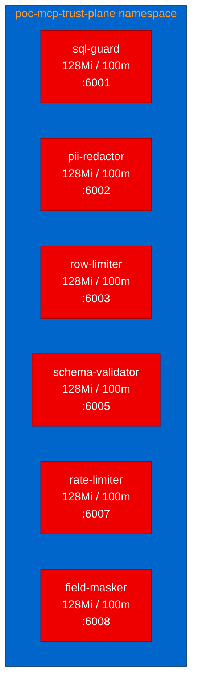

<!-- v2 changelog:
- Merged intro sections, moved rhetorical questions to opening hook
- Stated thesis explicitly in first paragraph
- Expanded PII test scenario with concrete JSON response
- Removed excessive inline backticks per Red Hat Developer Blog style
- Added CTA links to Red Hat product pages throughout
- Expanded acronyms on first use (PII, UBI, UID, MCP)
- Used full "Red Hat OpenShift" on first mention
- Added architecture overview Mermaid diagram
- Added filter-chain sequence diagram
- Added test results table
- Varied sentence structure in lessons section
- Added hero image placeholder
-->

--------------------
**[Image Placeholder 1: Hero image for MCP Trust Plane deployment]**

**Placement rationale**: Hero image at top to set visual context for the post
**Image generation prompt**: Clean modern illustration showing a shield icon intercepting data flow between an AI agent and external tools, using Red Hat brand colors (#EE0000 primary, #151515 dark background, #F0F0F0 light accents), minimal flat design style, 16:9 aspect ratio, no text overlays
**Alt text**: Illustration of a security filter layer intercepting data flow between an AI agent and external tools

--------------------

Your AI agent just ran a SQL query against your production database. Was it a safe SELECT, or did it sneak in a DROP TABLE? When agents can autonomously call tools through the Model Context Protocol (MCP), every tool call becomes an unreviewed action. MCP Trust Plane solves this by placing lightweight HTTP filter microservices in the path of MCP traffic. We deployed its six security filters on [Red Hat OpenShift](https://www.redhat.com/en/technologies/cloud-computing/openshift) to prove that zero-dependency Node.js guardrails can protect agent tool calls with minimal operational overhead.

## What is MCP Trust Plane?

MCP Trust Plane is an open-source filter framework for MCP traffic (Apache 2.0 license). Each filter is a standalone Node.js process with zero external npm dependencies. Filters communicate over a simple HTTP contract: POST /filter for security decisions, GET /health for readiness checks.

The project ships 60 filters: 6 cross-provider "common" filters and 54 provider-specific data guards. The common filters handle universal security concerns:

| Filter | Purpose | Port |
|---|---|---|
| sql-guard | Blocks dangerous SQL statements (DROP, DELETE, TRUNCATE) | 6001 |
| pii-redactor | Redacts personally identifiable information (PII) patterns | 6002 |
| row-limiter | Caps the number of rows in query results | 6003 |
| schema-validator | Validates tool-call arguments against JSON schemas | 6005 |
| rate-limiter | Enforces per-tool request rate limits | 6007 |
| field-masker | Masks sensitive fields in tool-call responses | 6008 |



*Filter chain flow: the sql-guard blocks dangerous queries before they reach the tool, while the pii-redactor sanitizes responses before they reach the agent.*

## Containerizing for Red Hat OpenShift with Universal Base Images (UBI)

Each filter's original Dockerfile used node:20-alpine: a 5-line file that copies package.json and index.js. Converting to [Red Hat UBI9](https://www.redhat.com/en/blog/introducing-red-hat-universal-base-image) required one structural change. The UBI Node.js image defaults to a non-root user (user identifier 1001), so we temporarily switch to root for the OpenShift permission fix:

```dockerfile
FROM registry.access.redhat.com/ubi9/nodejs-22

WORKDIR /opt/app-root/src
COPY package.json index.js ./
ENV PORT=6001

USER 0
RUN chgrp -R 0 /opt/app-root && chmod -R g=u /opt/app-root
USER 1001

EXPOSE 6001
CMD ["node", "index.js"]
```

No npm install step. The entire build copies two files and runs one permission command. Builds averaged 30 seconds per filter on the cluster.

Want to try UBI-based containerization for your own projects? Check out the [Red Hat Universal Base Image documentation](https://catalog.redhat.com/software/base-images).

## Deploying the filter fleet

We deployed all 6 common filters as independent Deployments in a dedicated namespace. Each filter gets its own Deployment and ClusterIP Service:



*All 6 filters deployed as independent pods. Total resource footprint: 768Mi memory, 600m CPU.*

Resource requests are minimal: 128Mi memory and 100m CPU per filter. All pods include readiness and liveness probes pointing at the /health endpoint. The Kubernetes manifests enforce [Red Hat OpenShift](https://www.redhat.com/en/technologies/cloud-computing/openshift) security best practices: no privilege escalation, all capabilities dropped, and no fixed user identifier (letting OpenShift assign its random UID).

## Testing the security guardrails

We ran 5 validation scenarios against the live deployment. Every scenario passed.

| Scenario | Result | Duration | Key observation |
|---|---|---|---|
| Health check (all 6 filters) | PASS | 40ms | All returned healthy with version info |
| SQL Guard: block DROP TABLE | PASS | 10ms | Correctly blocked with reason |
| SQL Guard: allow safe SELECT | PASS | <1ms | Passed with validation message |
| PII Redactor: email detection | PASS | <1ms | Evaluated content and returned assessment |
| Contract compliance: malformed JSON | PASS | 20ms | All 6 filters fail-open as designed |

The SQL guard test is worth highlighting. We sent a DROP TABLE statement and got back:

```json
{"action": "block", "reason": "Blocked: SQL contains 'DROP'"}
```

A safe SELECT query passed cleanly:

```json
{"action": "allow", "reason": "SQL validated successfully"}
```

The contract compliance test confirmed the most important design decision: when we sent malformed JSON to every filter, all 6 responded with an allow action. Broken filters should never block legitimate agent workflows. This fail-open behavior is deliberate and well-implemented.

## What we learned

Zero dependencies changed everything. No node_modules to install means fast builds, small images, and nothing to audit in the supply chain. For container environments where image size and build speed matter, this design choice pays compounding dividends.

OpenShift's arbitrary UID assignment requires a specific Dockerfile pattern. UBI images start as non-root, but the chgrp command for group 0 permissions needs root access. The solution is a brief USER 0 / USER 1001 sandwich around the permission fix. This took one build retry to discover.

The microservice-per-filter architecture mapped directly to Kubernetes primitives. Each filter is a standalone HTTP server, so it gets its own Deployment, Service, and scaling policy. No inter-service dependencies, no shared state (except the rate-limiter's in-memory counters), no coordination overhead.

One operational lesson: images built on the cluster still need explicit imagePullSecrets when pods run in a different namespace from the build. Common deployment pitfall, easy to fix, easier to forget.

## Try it yourself

The deployment is reproducible from the [forked repository](https://github.com/aicatalyst-team/mcp-trust-plane):

1. Clone the fork
2. Apply the Kubernetes manifests to your [Red Hat OpenShift AI](https://www.redhat.com/en/technologies/cloud-computing/openshift/openshift-ai) cluster
3. Run the test script

The UBI Dockerfiles, Kubernetes manifests, test script, and full PoC report are all committed to the repository. For the complete evaluation and artifacts, see the [autopoc-artifacts branch](https://github.com/aicatalyst-team/mcp-trust-plane/tree/autopoc-artifacts).
