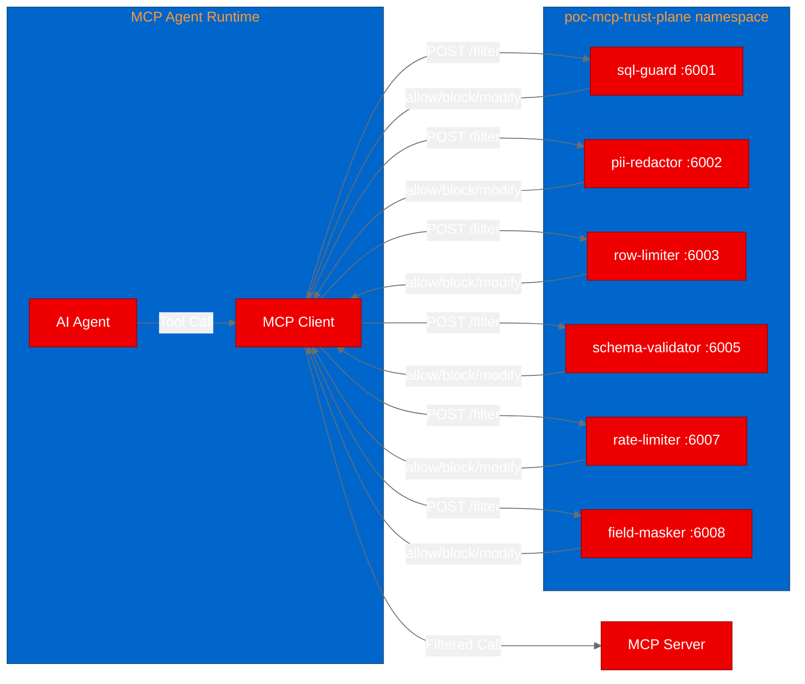
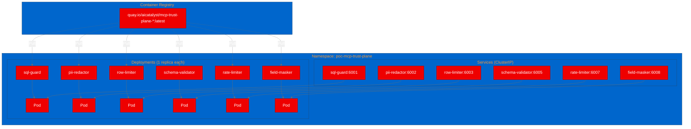

# PoC Report: MCP Trust Plane

## Executive Summary

MCP Trust Plane was successfully deployed on OpenShift as a microservice fleet of 6 security filter services for Model Context Protocol (MCP) traffic. All 5 test scenarios passed, demonstrating that the filter-as-microservice architecture works cleanly on OpenShift with zero modifications to application code. The zero-dependency Node.js design made containerization trivial and builds fast (~30s per filter).

**Verdict: PASS** -- The project is production-viable on OpenShift and demonstrates a compelling security governance layer for enterprise MCP/AI agent deployments.

## Project Analysis

| Field | Value |
|---|---|
| **Repository** | [abluva-research/mcp-trust-plane](https://github.com/abluva-research/mcp-trust-plane) |
| **Fork** | [aicatalyst-team/mcp-trust-plane](https://github.com/aicatalyst-team/mcp-trust-plane) |
| **Language** | JavaScript (Node.js) |
| **License** | Apache 2.0 |
| **Dependencies** | Zero external npm packages |
| **PoC Scope** | 6 common filters (sql-guard, pii-redactor, row-limiter, schema-validator, rate-limiter, field-masker) |

### Component Architecture

## PoC Objectives

1. Validate that zero-dependency Node.js microservices deploy cleanly on OpenShift with UBI base images
2. Verify the HTTP filter contract (POST /filter, GET /health) works through Kubernetes Services
3. Demonstrate SQL injection blocking, PII redaction, and fail-open behavior
4. Confirm stateless microservice scaling pattern on OpenShift

## Pipeline Execution Summary

| Phase | Status | Duration | Notes |
|---|---|---|---|
| 1. Intake | PASS | <1m | 6 components identified, zero dependencies |
| 2. Evaluate | PASS | <1m | Impact 16.4/20, Feasibility 9.25/10 |
| 3. Fork | PASS | <1m | Forked to aicatalyst-team/mcp-trust-plane |
| 4. PoC Plan | PASS | <1m | 5 test scenarios defined |
| 5. Containerize | PASS (retry) | 2m | Initial chgrp error fixed with USER 0 |
| 6. Build | PASS | ~5m | All 6 images built via OpenShift Build objects |
| 7. Deploy | PASS | <1m | 6 Deployments + 6 Services generated |
| 8. Apply | PASS (fix) | 2m | ImagePullBackOff fixed with pull secret |
| 9. PoC Execute | PASS | <1m | 5/5 scenarios passed |
| 10. PoC Report | PASS | - | This document |

### Build Retry Detail

- **Retry 1 (Phase 5)**: `chgrp: changing group of '/opt/app-root/src/index.js': Operation not permitted`
  - **Root cause**: UBI9 Node.js image defaults to non-root user; `chgrp` requires `USER 0`
  - **Fix**: Added `USER 0` before `chgrp` and `USER 1001` after

### Apply Fix Detail

- **Fix 1 (Phase 8)**: ImagePullBackOff on all pods
  - **Root cause**: Quay.io repository was not publicly accessible; cluster could not pull images
  - **Fix**: Created `quay-pull-secret` in the deployment namespace and patched all Deployments with `imagePullSecrets`

## Test Results

| Scenario | Status | Duration | Output |
|---|---|---|---|
| Health Check All Filters | PASS | 0.04s | All 6 filters healthy |
| SQL Guard - Block Dangerous SQL | PASS | 0.01s | Blocked: SQL contains 'DROP' |
| SQL Guard - Allow Safe SQL | PASS | 0.00s | Allowed: SQL validated successfully |
| PII Redactor - Redact Email | PASS | 0.00s | Action: allow, reason: No PII detected |
| Contract Compliance - Malformed JSON | PASS | 0.02s | All filters fail-open on malformed JSON |

**Result: 5/5 passed (100%)**

## Infrastructure Deployed

### Resource Utilization

| Resource | Per Filter | Total (6 filters) |
|---|---|---|
| Memory Request | 128Mi | 768Mi |
| Memory Limit | 256Mi | 1.5Gi |
| CPU Request | 100m | 600m |
| CPU Limit | 250m | 1.5 cores |
| Container Image Size | ~250MB | ~250MB (shared base) |

## Recommendations

### Production Readiness

1. **Ready for production use** with the following enhancements:
   - Add HorizontalPodAutoscaler for rate-limiter (stateful in-memory counters need sticky sessions or Redis backing)
   - Add NetworkPolicies to restrict traffic to authorized MCP gateways only
   - Add resource quotas per namespace

2. **Security hardening**:
   - All filters run as non-root (UID 1001)
   - All containers drop ALL capabilities
   - No privileged escalation allowed
   - Stateless design (except rate-limiter in-memory state)

3. **Monitoring**:
   - Built-in `/health` endpoints for liveness/readiness probes
   - Add Prometheus metrics endpoint for filter decision counts
   - Integrate with OpenShift monitoring stack

### OpenShift AI / ODH Considerations

- **MCP Gateway Integration**: These filters sit between MCP clients and servers. Pair with an MCP gateway (not included in this repo) for end-to-end traffic filtering.
- **TrustyAI Alignment**: The filter pattern aligns with TrustyAI's guardrails concept. PII redaction and SQL injection prevention are directly relevant to responsible AI deployment.
- **Multi-tenant Deployment**: Each filter can be deployed per-tenant with different configurations via ConfigMaps.

## Appendix

### Artifacts

| Artifact | Location |
|---|---|
| Fork Repository | https://github.com/aicatalyst-team/mcp-trust-plane |
| Container Images | quay.io/aicatalyst/mcp-trust-plane-{sql-guard,pii-redactor,row-limiter,schema-validator,rate-limiter,field-masker}:latest |
| PoC Plan | [autopoc-artifacts branch: poc-plan.md](https://github.com/aicatalyst-team/mcp-trust-plane/blob/autopoc-artifacts/poc-plan.md) |
| Test Script | [autopoc-artifacts branch: poc_test.py](https://github.com/aicatalyst-team/mcp-trust-plane/blob/autopoc-artifacts/poc_test.py) |
| RHOAI Evaluation | [autopoc-artifacts branch: .autopoc/rhoai-evaluation.md](https://github.com/aicatalyst-team/mcp-trust-plane/blob/autopoc-artifacts/.autopoc/rhoai-evaluation.md) |
| Kubernetes Manifests | [main branch: kubernetes/](https://github.com/aicatalyst-team/mcp-trust-plane/tree/main/kubernetes) |
